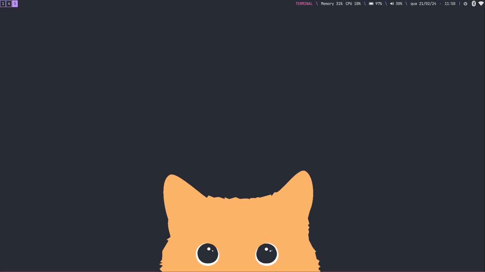
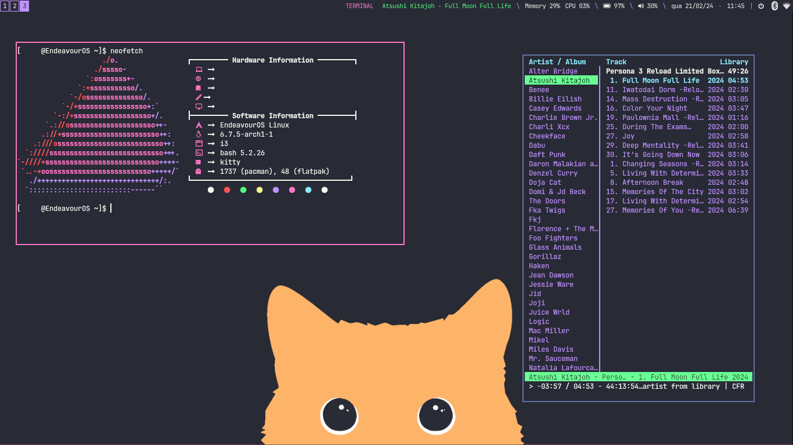
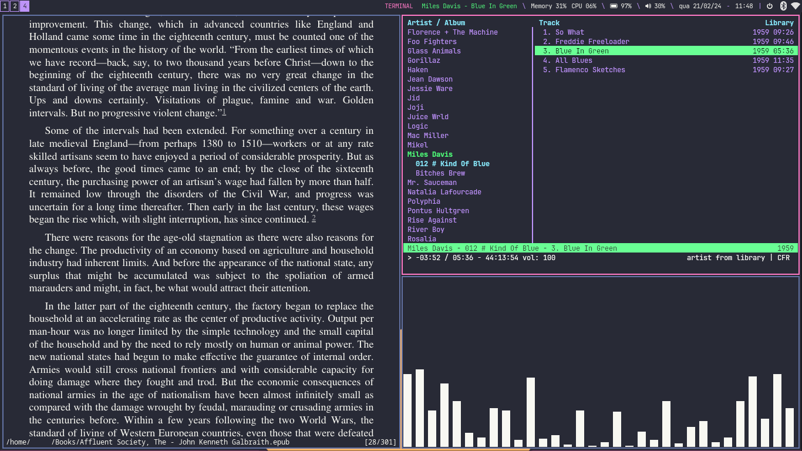

# Dracula Theme for i3wm
This is my dotfiles, based on the endeavourOS i3 theme, rethemed with a Dracula palette.

**Warning**: Do not use this blindly, make sure it works with your personal setup and options first

## Dependencies and optional additions

- i3lock-color
- rofi
- nerd-fonts
- brightnessctl
- i3-battery-popup
- Permit the "wallpaper.sh" shell script in '~/.config/i3/scripts' if you want the wallpaper script working on login
- Permit the "i3bartoggle.sh" shell script in '~/.config/i3/scripts' to enable hiding the top bar

## Contents

- rofi config
- i3 config

## Other notes
- Using *JetBrainsMono NF* and *BitstromWera* Nerdfonts 
- Keybinds are heavily customized, make sure you change them to your own preferences before using this
- Go to the [official dracula theme website](https://draculatheme.com/) for more theming options for your apps

### Apps shown on screenshots

- [Dracula themed kitty](https://draculatheme.com/kitty) 
- rofi
- cmus (with ':colorscheme dracula' set)
- [Dracula themed zathura](https://draculatheme.com/zathura)
- cava
