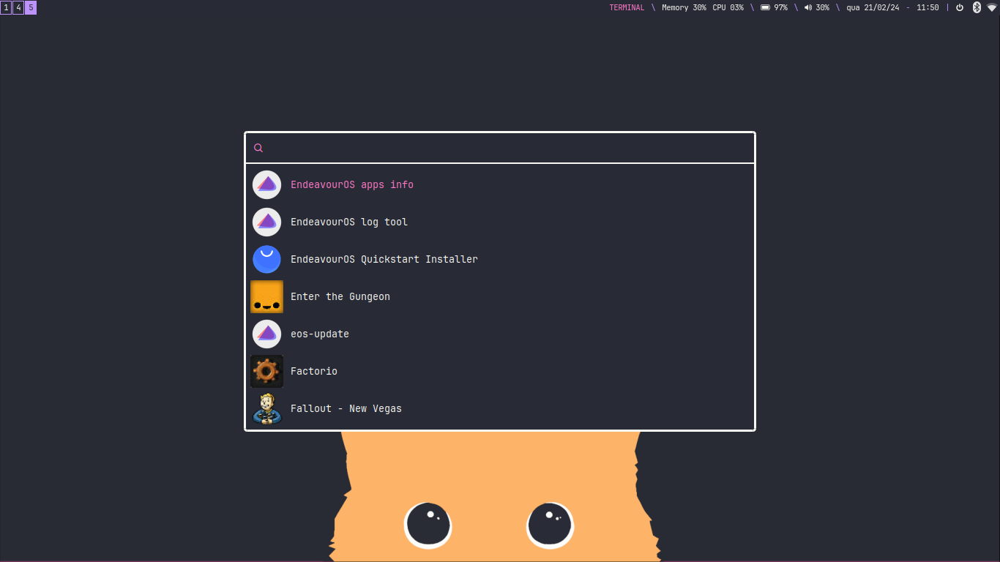

# Dracula Theme for i3wm
This is my dotfiles, based on the endeavourOS i3 theme, rethemed with a Dracula palette.

**Warning**: Do not use this blindly, make sure it works with your personal setup and options first

## Apps shown

- kitty
- rofi
- cmus
- zathura
- cava

## Contents

- rofi config
- kitty config
- zathura config
- i3 config

## Other notes
- Using *JetBrainsMono NF* Nerdfont 
- Keybinds are heavily customized, make sure you change them to your own preferences before using this
- Also using GTK theme for dracula [found here](https://github.com/dracula/gtk)
